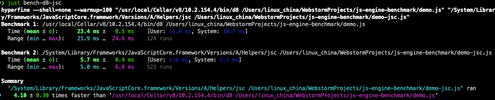
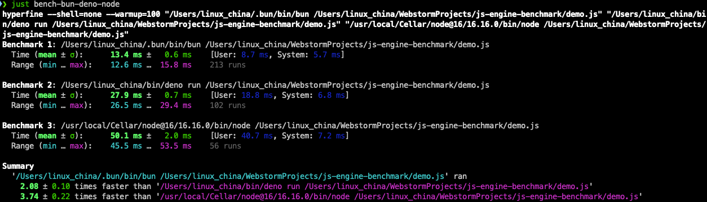
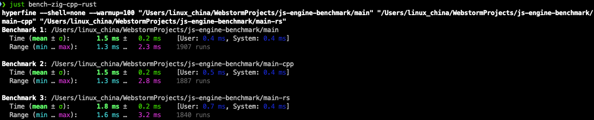

JavaScript engine benchmark
============================

# Benchmark environment

* MacOS Monterey 12.4
* MacBook Pro(15-inch, 2018)
* Processor 2.0 GHz 6-Core Intel Core i9
* Memory 32G 2400 MHz DDR4
* Versions: V8 - 10.6.43, Bun - 0.1.5, Deno - 1.24.0, Node - 16.16.0

# Test cases

* V8 vs JSC: jsc win
  
* Bun vs Deno vs Node: bun win
  
* Zig vs Cpp vs Rust: Zig win
  

Summary: Bun is written by Zig and based on JSC, and it could be fast. 

# References

* Bun: https://bun.sh/
* Deno: https://deno.land/
* Node: https://nodejs.org/
* v8: https://v8.dev/
* JSC: https://developer.apple.com/documentation/javascriptcore
* hyperfine: a command-line benchmarking tool https://github.com/sharkdp/hyperfine
